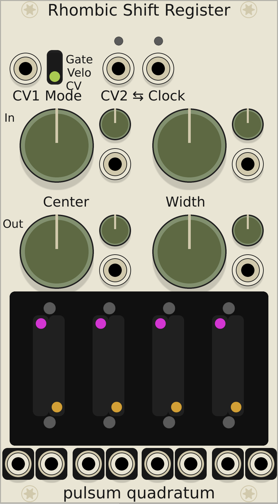

<figure>
  <label for="mn-download" class="margin-toggle">Download</label>
  <input type="checkbox" id="mn-download" class="margin-toggle">
  
  <a href="https://github.com/bongozone/bongozone.github.io/releases">Download time-limited beta version</a> 
  <em class="danger">requires VCVRack 0.6 built from Git; may not work with newer builds</em>
  
  <label for="mn-exports-imports" class="margin-toggle">Photos</label><input type="checkbox" id="mn-exports-imports" class="margin-toggle">
  
   
  <em>Not final layout.</em>
  
</figure>

Pan-and-Shift is a four voice, voltage-controlled
looping shift register for the <a href="http://www.vcvrack.com/">VCVRack</a> modular synthesis environment.
By carefully applying modulation to the Pan-and-Shift, automatic variations upon
melodic patterns may generated.

## Shift Registers

The Pan-and-Shift has 4 independent shift registers, denoted <strong>lanes</strong>. Each lane
has two <strong>channels</strong>. The left-hand channel is intended for a pitch CV, for generating a melody.
The right-hand channel may be utilized for a secondary modulation, or a pattern of gates.

Each lane has two parameters associated with it. The left-hand lane slider determines
the <em>length</em> of the shift register. In the fully lowered position, there are 16
stages. The right-hand slider moves the location of the tap or output. If the right <em>tap</em>
value is greater than the left <em>length</em> value, the tap will be set to the last stage
of the lane. Independent values for the tap position and the lane length will be
useful when utilizing the looping feature.

## Pan and Scan Sections

Below the primary CV inputs there are two pan-and-scan<label for="sn-ps" class="margin-toggle sidenote-number"></label><input type="checkbox" id="sn-ps" class="margin-toggle">See Make Noise RxMx, Verbos Pan and Scan, Toppobrillo Mixiplexer, etc.
blocks, one for the channel inputs &amp; and one for the channel outputs. By adjusting the position of these knobs and applying
modulation to the inputs, you may control which lanes are receiving input
and which lanes are outputting. The state of each lane and its activity are
indicated by the LEDs above and below each channel.

When neither the input the output nor the input of a lane is active, a clock trigger
will not cause the state of a lane to change.<label for="sn-muted" class="margin-toggle sidenote-number"></label><input type="checkbox" id="sn-muted" class="margin-toggle">
  This functionality may change in future revisions to be controlled by a panel switch.

When the input for a lane is disabled but the output is enabled, a clock pulse
will advance the pattern normally, but the final memory cell of the lane<label for="sn-looping" class="margin-toggle sidenote-number"></label><input type="checkbox" id="sn-looping" class="margin-toggle">
e.g. the cell at the position pointed to by <em>length</em>
 will be
copied into the input, causing <em>looping</em>.

By passing the width control counterclockwise, past 12 o'clock<label for="sn-neg" class="margin-toggle sidenote-number"></label><input type="checkbox" id="sn-neg" class="margin-toggle">
  Or applying modulation such that the summed <em>width</em> voltage is negative.
,
we engage <em>inverted channel width</em>. By doing so, the channel with grows inwards from
the outer channels towards the center point.

## Modes

The CV2 channel has three modes accessible from the panel switch:

Gate mode outputs a 10-volt gate if the value
in the CV channel is high. When CV2 is normalled to the clock input, the CV2 channels
will generate short trigger pulses instead of gates.

Velocity mode outputs the stored CV while the
input clock is high. This is useful for generating a variable height modulation
envelope with a slew limiter.<label for="sn-befaco" class="margin-toggle sidenote-number"></label><input type="checkbox" id="sn-befaco" class="margin-toggle">
    The Slew Limiter and Rampage modules from Befaco are good candidate for this application in VCVRack.

CV mode causes the right channel to operate identically
to the left-hand channel. This is useful for encoding a timbre parameter.

## Normalling

CV2 and clock inputs are bidirectionally normalled to each other.
<em>Width</em> and <em>center</em> modulation inputs are normalled downwards
from the input block to the output block.

<!--
<ul>
  
    <li>
      <a href="{{ post.url }}">{{ post.title }}</a>
      ({{ post.date | date_to_string }})
      {{ post.content}}
    </li>
  
</ul>
-->
